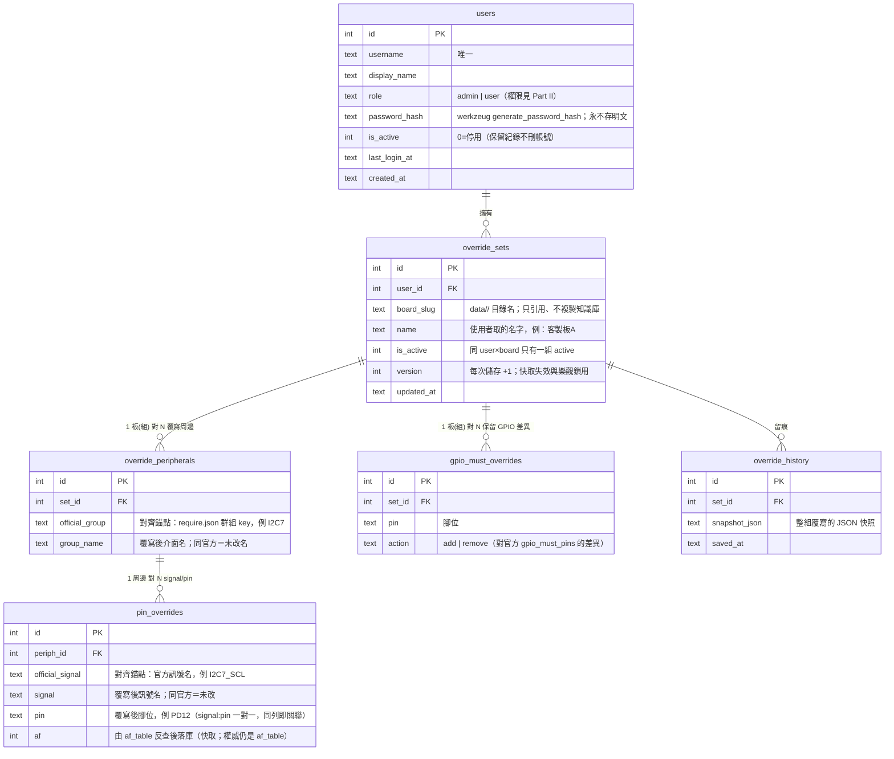

# USER_SYSTEM_PLAN — 使用者系統總計劃：登入/登出・註冊與使用者管理・pin 覆寫資料庫化

（2026-08-09。整合原 PIN_OVERRIDE_DB_PLAN 而成的**大計劃**，分三個部分：
Part I 登入/登出、Part II 註冊與使用者管理、Part III pin 覆寫資料庫化。
共用同一個資料庫與同一套權限模型。）

> **實作進度（2026-08-09）：M1–M5 已完成落地**——`src/store/`（db/users/
> overrides DAO＋create_admin CLI）、`src/web/auth.py`（登入/登出/使用者管理
> ＋全站 before_request）、`src/web/overrides_api.py`（GET/PUT＋六道驗證）、
> `dataio.effective_require()`＋`_Board(require_data)`＋`_load_board`
> 快取 key `(board, set_id, version)`＋chat session 綁定與 user 命名空間＋
> `output/generated/plan.used.meta.json` 溯源。M5 回歸驗收（counts self-test
> ／patch_agent locate／無覆寫 byte 級不變）全綠。M6 未做（可選）。

---

## 0. 總覽

```
未登入 ──► 登入頁（POST /api/login）──► 全站功能
                                          │
                    ┌─────────────────────┼──────────────────────┐
                 一般 user             admin                （CLI，不經 web）
                    │                     │                       │
             用共用知識庫求解        ＋上傳/刪除板子          註冊 admin 帳號
             維護自己的腳位覆寫      ＋建立/管理一般 user     （create_admin 工具）
                                     ＋檢視/停用他人覆寫
```

**核心原則**：
- **登入後才能使用系統**——所有 API 與頁面都在保護範圍內（僅登入端點與
  登入頁例外）。
- **註冊無自助通道**：admin 只能用 **command line** 註冊；一般 user 由
  admin 在系統（web）內建立。CLI 工具與 web 走**同一個 DAO、自動連同一個
  資料庫**，不存在第二份設定。
- **知識庫共用**：`data/<board>/`（JSON/noSQL）是所有使用者共用的基底，
  DB 只以 `board_slug` 引用、不複製；**只有開機腳位與安全腳位是 per-user**。
- **真實知識庫永不被覆寫機制修改**——DB 只存差異。
- 既有紅線全部不變：路徑權威（`dataio._BOARD_FILES`／`patch_agent/config.py`）、
  `require.json` 與 `boot_requirements.json` 永不合併（紅線 6）、LLM 永不
  接觸覆寫寫入、輸出防偽 fingerprint 機制不動。

---

## 1. 資料庫（三部分共用）

| 項目 | 決定 | 理由 |
|---|---|---|
| 引擎 | **SQLite（WAL 模式）** | 單機 Flask、零部署成本；WAL 支援讀寫並行。DAO 只用標準 SQL，未來可平移 Postgres |
| 位置 | `var/dts_agent.db`（新目錄，gitignore） | 不能放 `output/`（覆寫制、可拋棄——使用者資料必須持久）；不能放 `data/`（知識庫定位） |
| 存取層 | `src/store/db.py`（連線/建表/migration）＋`src/store/users.py`＋`src/store/overrides.py` | 所有 SQL 集中 store/；web 與 CLI 共用同一入口，「自動連上同一個資料庫」由此保證 |
| Secret | `var/secret_key`（首次啟動自動生成，gitignore） | Flask session cookie 簽章；不進 git、不用手動設 |

### 1.1 ERD（全表）



---

## Part I — 登入 / 登出

### I.1 機制

- **憑證**：username＋password。密碼以 `werkzeug.security.generate_password_hash`
  （Flask 內建依賴，scrypt/pbkdf2）雜湊落庫，驗證用 `check_password_hash`；
  **任何地方不存、不記 log 明文**。
- **Session**：Flask 簽章 cookie（`HttpOnly`＋`SameSite=Lax`），內容只放
  `user_id`；伺服器每請求由 DB 查 user（含 `is_active` 檢查——被 admin
  停用的帳號下一個請求即失效，不用等 cookie 過期）。有效期預設 7 天。
- **保護範圍**：Flask `before_request` 全站攔截，白名單只有
  `POST /api/login`、登入頁靜態資源。其餘一律未登入回 **401**
  （API）／導向登入頁（頁面）。
- **登出**：`POST /api/logout` 清 session cookie。
- **暴力嘗試防護**：同 username 連續失敗 5 次鎖 60 秒（in-memory 計數即可，
  單機夠用）；登入失敗訊息統一「帳號或密碼錯誤」，不洩漏帳號是否存在。

### I.2 端點

| 端點 | 說明 |
|---|---|
| `POST /api/login` | body `{username, password}` → 設 session cookie，回 `{username, display_name, role}`；失敗 401 |
| `POST /api/logout` | 清 session，回 `{ok: true}` |
| `GET /api/me` | 回目前登入者 `{username, display_name, role}`；未登入 401——前端開機第一個呼叫，決定顯示登入頁或主畫面 |

### I.3 前端

- 新增**登入畫面**（全版遮罩，風格沿用設定頁彈窗）：username/password 兩欄
  ＋登入鈕＋錯誤訊息。app 啟動先打 `GET /api/me`：401 → 只顯示登入畫面；
  200 → 進主畫面並在 header 顯示使用者名（點開含「登出」）。
- 所有既有 fetch 加一層共用 401 攔截：任何請求收到 401 → 回登入畫面
  （session 過期的體驗一致）。
- 登出後清空對話與 `chatSessionId`（沿用換板即重置的既有模式）。

### I.4 Bootstrap（全新安裝）

DB 裡一個 user 都沒有時，登入頁顯示引導文案：
「尚未建立任何帳號——請在伺服器上執行 `python -m store.create_admin` 建立
第一個 admin」。**web 上永遠沒有自助註冊**。

---

## Part II — 註冊與使用者管理

### II.1 註冊途徑（唯二）

| 對象 | 途徑 | 說明 |
|---|---|---|
| **admin** | **CLI only**：`PYTHONPATH=src venv/bin/python -m store.create_admin` | 互動式問 username／display name／密碼（`getpass` 不回顯）；直接走 `src/store/` DAO → **自動連上 `var/dts_agent.db`**（與 web 同一路徑常數，無第二份設定）。可重複執行建多個 admin；username 撞名即報錯 |
| **一般 user** | **admin 在 web 建立** | 設定頁新增「使用者管理」區塊（admin-only）：建立帳號（username／display name／初始密碼）、重設密碼、停用/啟用。不做 email 邀請流——單機工具，admin 口頭交付初始密碼即可 |

### II.2 權限矩陣（users.role）

| 動作 | user | admin |
|---|---|---|
| 登入後使用求解／DTS 生成全功能（共用知識庫） | ✔ | ✔ |
| 維護**自己的**腳位覆寫組（CRUD） | ✔ | ✔ |
| 上傳/刪除板子（知識庫變動；設定頁「新增板子」） | ✘ | ✔ |
| 建立/停用一般 user、重設密碼（使用者管理） | ✘ | ✔ |
| 檢視/停用**他人**的覆寫組 | ✘ | ✔ |
| 建立 admin | ✘ | ✘（只有 CLI 可以） |

原則:知識庫是共用資產，變動入口收斂到 admin；覆寫是個人資產，人人管自己的。
web 上不能產生 admin（含 admin 自己也不行）——admin 的產生只在伺服器 CLI，
把「最高權限的發放」跟「拿得到伺服器 shell」綁在一起。

### II.3 端點（全部 admin-only，非 admin 403）

| 端點 | 說明 |
|---|---|
| `GET /api/users` | 使用者清單（不含 password_hash） |
| `POST /api/users` | 建立一般 user `{username, display_name, password}`；role 固定 'user'，**不接受 role 參數**（防越權） |
| `PATCH /api/users/<id>` | `{password?}` 重設密碼／`{is_active?}` 停用/啟用；不可改 role、不可停用自己 |
| `/api/boards/create*` | 既有板子上傳端點加 admin gate；`/api/boards` 的 `can_create` 改為依角色計算（前端沿用既有欄位零修改） |

### II.4 前端

設定頁新增「使用者管理」區塊（`role=admin` 才渲染）：使用者表格
（帳號／名稱／角色／狀態／最後登入）＋建立表單＋每列停用/重設密碼按鈕。
「新增板子」區塊顯示條件改為後端回的 `can_create`（已含角色判斷）。

---

## Part III — pin 覆寫資料庫化

（表結構見 §1.1：`override_sets → override_peripherals → pin_overrides`
三層正規化＋`gpio_must_overrides`。）

### III.1 設計要點

- **三層正規化**：介面改名（例：PMIC 從 I2C7 搬 I2C6）存在
  `override_peripherals.group_name`——只存一次，不在每個 pin 列重複；
  與前端「介面格整組同步」行為天然對齊。
- **只存差異**：PUT 送整張表的目前值，後端與 require.json 逐欄比對，
  「與官方相同」的周邊/列不落庫。空 set＝無覆寫。
- **對齊錨點**：`official_group`＋`official_signal` 是不變 key（永遠指向
  require.json 那一列）。官方知識庫升級後覆寫仍能對齊；對不上的孤兒列
  GET 時標 `stale: true` 給前端顯示，不參與合併。
- **AF 落庫是快取不是權威**：使用者只填腳位，後端從 `af_table[pin]` 反查
  AF；查不到＝驗證失敗，查到多個＝要求前端明確選擇（未來欄位）。
- **安全腳位**兩類都涵蓋：(a) `gpio_must_pins` 用 `gpio_must_overrides`
  的 add/remove（板(組) 1:N GPIO）；(b) `reserve_only` 群組（OCTOSPIM_P1/
  I2C7）走 peripherals＋pin_overrides（同一機制天然覆蓋）。
- **一 user 一板一 active set**；schema 已預留多具名 set（`name`＋
  `is_active`），未來多種客製不用改表。

### III.2 合併語意（effective require）

新函式（`src/util/dataio.py`，路徑權威不變）：

```
effective_require(board, override_set_id | None) -> dict
```

1. 讀官方 `require.json`（基底）。
2. set 為 None 或查無資料 → **原樣返回**（現行為 byte 級不變）。
3. 有覆寫 → 深拷貝後疊加：
   - `override_peripherals`：以 `official_group` 定位群組；`group_name`
     改了＝整組 rename（group key 與訊號前綴同步改）。
   - `pin_overrides`：以 `official_signal` 定位 `pin_map` 列，替換
     [signal, pin, af]。
   - `gpio_must_overrides`：對 `gpio_must_pins.pins` 做 add/remove。
   - 其餘欄位（role、solver_action、in_kernel_dt、dt_pin_groups…）不可
     覆寫——覆寫只動「腳位在哪」，不動「這組是什麼、歸誰管」。
4. 結果再走既有 loaders（加「已載入 dict」入口，簽名向前相容）。

合併固定**兩層**：`官方 require.json ⊕ user 個人組`。（曾評估 admin 板級
共用覆寫組的三層設計，決議不做——覆寫一律屬於個別使用者。）

### III.3 更新後如何改變生成

**注入點一處收斂**：第一段所有 require.json 消費者都匯流在
`service._Board.__init__`（load_gpio_pins / load_require_signals /
load_pin_locked / load_reserved ＋ boot_roles）：

- `_Board.__init__(board, override_set)` 改吃 `effective_require()` 結果；
  solver/counts/clarify/orchestrator **零修改**（只消費 _Board 派生值）。
- `Pipeline._load_board` 快取 key：`board` → `(board, set_id, set_version)`。
  儲存覆寫 version++ → 舊快取自然失效。未登入不存在（全站要登入）；
  user 無覆寫 → key `(board, None, 0)`，行為同現況。

**第一段影響鏈**：

```
使用者儲存覆寫（version++）
  → 下個 /api/chat 或 /api/solve（帶 session user → active set）
  → _load_board 重建 _Board
  → pin_locked／must_gpio／reserved_* 全變（例：SDMMC1_CK 從 PE3 → 覆寫腳；
     PMIC 搬 I2C6 → I2C6 封鎖、I2C7 釋出）
  → boot 注入與 CSP 以新常數求解 → plan boot 列輸出新腳
```

**第二段零修改**：入口是 plan.csv（腳位已是最終值）。開機組換腳後官方
pinctrl 與 plan 不一致 → 既有 **supersede 機制**自動註解舊段、managed
region 用新腳；`boot_requirements.json` 不動（紅線 6）。需補的只有：
web single-flight DTS 工作者把 set 資訊記進 plan.meta（產物可追溯
「這份 DTS 是用哪組覆寫算的」）。

**驗證（CubeMX）零修改**：驗的是 plan。注意 CubeMX 驗的是 SoC 能力不是
板路由，客製腳位 PASS 是正確語意（「我的板子就是這樣接」）。

**進行中 chat session**：綁舊 _Board 推理歷史 → 儲存成功後前端提示
「新的對話開始生效」，下次送訊息自動開新 session（沿用換板重置模式）。

### III.4 寫入驗證（PUT 守門，依序）

1. **格式**：group `[A-Z0-9_]{2,}`、signal `[A-Z0-9_/]{2,}`、
   pin `P[A-Z]\d{1,2}`（前端已驗，後端重驗——前端驗證只是 UX）。
2. **腳位存在**：pin ∈ af_table（該板知識庫）。
3. **訊號可達**：af_table[pin] 某 AF 能出該 signal → 反查 af 落庫；
   查不到＝物理上出不了，拒絕並回報可用腳位清單（af_table 反查，資料驅動）。
4. **instance rename 合法**：新 instance 必須存在於 Σ。
5. **內部無撞腳**：覆寫後腳位＋未覆寫官方腳位＋gpio_must（覆寫後）兩兩不重複。
6. **樂觀鎖**：PUT 帶 `base_version`，與 DB 不符回 409，前端提示重載。

全過 → 交易內：差異落庫、version++、寫 override_history 快照。

（決議：儲存時**不做全域可解性檢查**——改腳是否導致某需求 UNSAT 依需求
而定、成本高，由求解時既有人話診斷承接。）

### III.5 覆寫端點

| 端點 | 說明 |
|---|---|
| `GET /api/boards/<board>/pin-overrides` | scope 到當前登入 user 的 active set。回 `{entries:[…], set:{id,name,version}, source:"db"\|"official"}`；entries 形狀＝前端現契約（含 override_* 欄） |
| `PUT /api/boards/<board>/pin-overrides` | body 加 `base_version`；驗證失敗 400＋逐列錯誤；衝突 409 |
| `/api/chat`、`/api/solve`、`/api/dts/*` | 介面不變；內部依 session user 解析 active set → `_load_board(board, set)` |

---

## 4. 統一里程碑

| 階段 | 內容 | 驗收標準 |
|---|---|---|
| **M1 資料層＋CLI 註冊** | `var/`＋SQLite schema（§1.1 全表）＋store/ DAO＋`store.create_admin` CLI | CLI 建 admin 成功、重複 username 報錯、密碼不回顯不落明文；DB 重啟不丟 |
| **M2 登入/登出** | before_request 全站保護＋login/logout/me 端點＋前端登入畫面＋401 攔截 | 未登入打任何 API 得 401；登入後全功能如常；登出即失效；連錯 5 次被鎖 60 秒 |
| **M3 使用者管理** | admin-only user CRUD 端點＋設定頁「使用者管理」區塊＋板子上傳 admin gate | admin 能建/停用 user、重設密碼；user 看不到管理區與「新增板子」，直呼端點 403；被停用帳號下一請求即登出 |
| **M4 覆寫資料層** | GET/PUT pin-overrides（含 III.4 驗證）scope 到登入 user；前端 demo 模式自動退場 | 兩帳號各自覆寫互不影響；填不存在的腳 400；併發儲存後到方 409 |
| **M5 生成接線** | `effective_require()`＋loaders dict 入口＋`_Board`/`_load_board` 快取 key 改造＋plan.meta 記 set | 覆寫 SDMMC1 任一腳 → plan boot 列輸出新腳；刪覆寫回官方；**無覆寫時既有行為 byte 級不變**（回歸指令集見下）；端到端：覆寫開機腳 → DTS 官方 pinctrl 被 supersede、managed region 用新腳、dtc 過 |
| **M6 進階（可選）** | 多具名 set 切換、override_history 檢視/回滾、匯出 overlay JSON | — |

**M5 回歸驗收指令集**（無覆寫時必須全綠且輸出不變）：
`PYTHONPATH=src venv/bin/python src/solver/counts.py`、
`PYTHONPATH=src venv/bin/python -m patch_agent locate`、
web 以既有需求（test.md 測試 1–3）重跑並 diff plan.csv。

---

## 5. 風險與對策

| 風險 | 對策 |
|---|---|
| 所有帳號都登不進（密碼全忘） | CLI `store.create_admin` 隨時可再建 admin——拿得到伺服器 shell 就救得回來 |
| DB 損毀/不可讀 | 啟動偵測；登入系統不可用時明確報錯（不靜默放行）；覆寫是差異層，重建 DB 只是回到官方板＋重建帳號 |
| 官方 require.json 升級後覆寫孤兒化 | 錨點對不上的列 GET 標 `stale`、不參與合併；history 可回看 |
| 多 worker 部署（未來） | SQLite WAL 撐單機多程序；in-memory 登入鎖/嘗試計數需搬 DB 或 Redis（到那一步再做）；DAO SQL 已標準化可平移 Postgres |
| 覆寫後 UNSAT | 求解端既有人話診斷承接（III.4 決議） |
| session 舊資料誤導 | 「新對話生效」策略＋儲存成功提示（III.3） |
| CLI 與 web 連到不同 DB | 不可能 by design：兩者 import 同一個 `store/db.py` 路徑常數；DB 路徑不提供環境變數覆寫（避免分裂），要搬家改 store/db.py 一處 |
| **plan／validator／DTS 產物是全程序共享**（已知限制，2026-08-09 審查確認） | `_last_plan`、`output/validator/`、`output/generated/`（含 plan.used.meta.json 的 user/set 溯源欄）沿用單一槽位＋覆寫制設計——任何登入使用者都讀得到「最近一次」求解/驗證/DTS 的內容，覆寫算出的腳位與 set 溯源因此對其他登入者可見。單機少人內部工具接受此模型；要升級成多人隔離需把這三處 per-user 化（output/<user>/ 分目錄＋狀態按 user 分槽），屆時再做 |
